### Clean-up

_Delete resources in reverse order of creation — dependent resources first, foundational resources last — to avoid dependency errors._

### 1. CloudWatch — delete Alarms, Metric Filters, Log Groups, SNS

1. CloudWatch Console → **Alarms** → select all 3 alarms (`common-metric`, `http-4xx-count`, `http-5xx-count`) → **Actions → Delete**

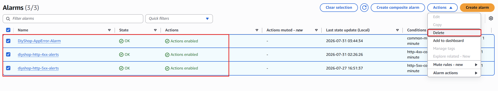

2. CloudWatch Console → **Log groups** → `/diyshop/app` → **Metric filters** tab → delete the `common-metric` filter; repeat for `/diyshop/access` (delete `http-4xx-count`, `http-5xx-count`)

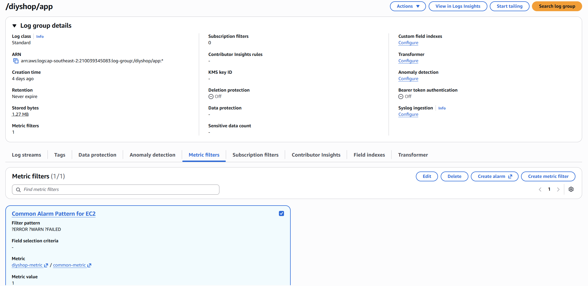

3. Delete both Log Groups: `/diyshop/app`, `/diyshop/access` → **Actions → Delete log group(s)**

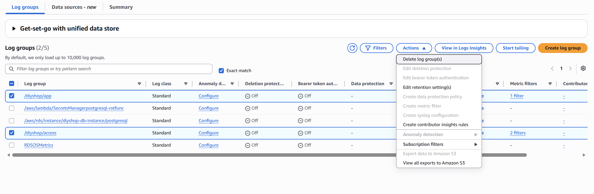

4. SNS Console → **Topics** → select `diyshop-alerts` → **Delete** (the attached email subscription is removed automatically with the topic)

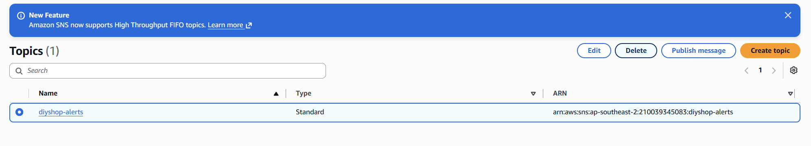

### 2. EC2 — terminate the instance + release the Elastic IP

1. EC2 Console → **Instances** → select `diyshop-app-server` → **Instance state → Terminate instance**
2. **Important — easy to miss, causes ongoing charges:** terminating the instance does **not** automatically release the Elastic IP. Go to EC2 Console → **Elastic IPs** → select the now-unassociated IP → **Actions → Release Elastic IP address** (depends on your configuration)

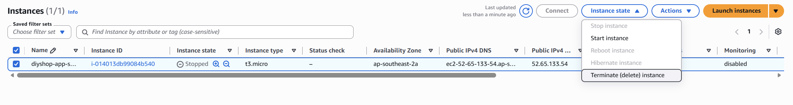

### 3. S3 — empty the bucket before deleting

1. S3 Console → select bucket `diyshop-s3-bucket-...` → **Empty** (type the bucket name to confirm) — a bucket containing objects cannot be deleted directly
2. Once empty → **Delete** the bucket (type the bucket name to confirm again)

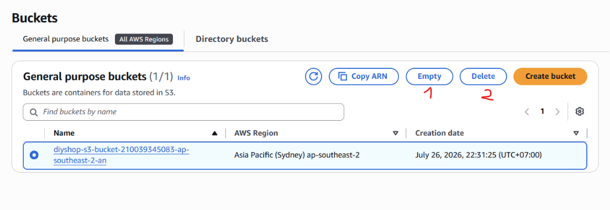

### 4. IAM — delete the Role and Policy

1. IAM Console → **Roles** → `diyshop-ec2-role` → **Permissions** tab → **Detach** the `diyshop-s3-product-images-policy` policy first
2. Delete the role: **Roles** → select `diyshop-ec2-role` → **Delete**

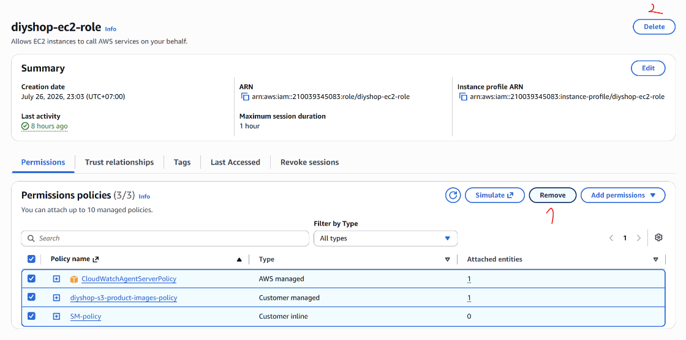

3. Delete the policy: **Policies** → select `diyshop-s3-product-images-policy` → **Delete**

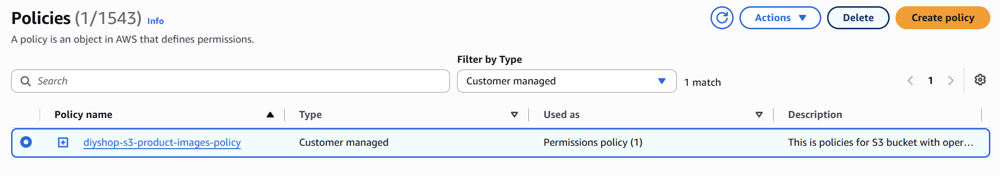

### 5. RDS — delete the DB instance

1. RDS Console → **Databases** → select `diyshop-db-instance` → **Modify** → if **Deletion protection** is enabled, disable it first, then **Apply**
2. **Actions → Delete**
3. Optional: check **"Create final snapshot"** if you want a backup before deletion (recommended for real production, not required for this lab), or leave it unchecked for a test-only environment
4. Type `delete me` to confirm → **Delete**

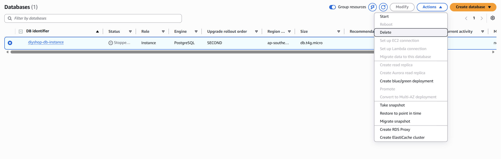

5. Once the instance is deleted, also delete the **DB Subnet Group** (`rds-subnet-group`) under Subnet groups

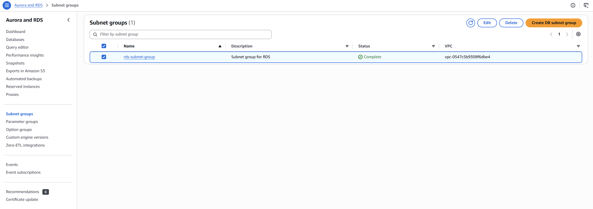

### 6. Security Groups — delete the custom SGs

1. VPC Console → **Security Groups** → delete `EC2-WebApp-SG` and `SG-RDSPostgreSQL`
2. **Do not delete** the VPC's `default` security group — it wasn't created manually and shouldn't be removed

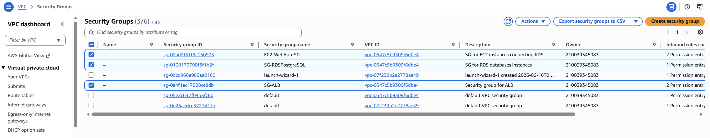

### 7. VPC Endpoint

1. VPC Console → **Endpoints** → select `diy-vpce-s3` (or the auto-generated name if created via the "VPC and more" wizard) → **Delete VPC endpoints**

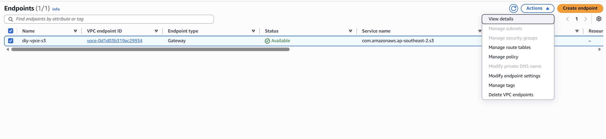

### 8. VPC — delete everything (last step)

1. VPC Console → **Your VPCs** → select `diy-vpc` → **Actions → Delete VPC**
2. The console lists all remaining child resources (subnets, route tables, Internet Gateway) and deletes them together once confirmed — this is the final cleanup step

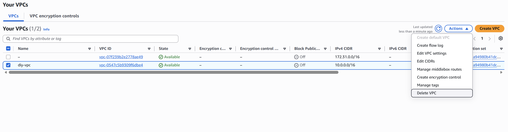

---

**Post-cleanup verification:** Billing Console → confirm no resource tied to `diy-vpc`/`diyshop-*` is still incurring charges; VPC Console → **Your VPCs** → confirm `diy-vpc` no longer appears in the list.
